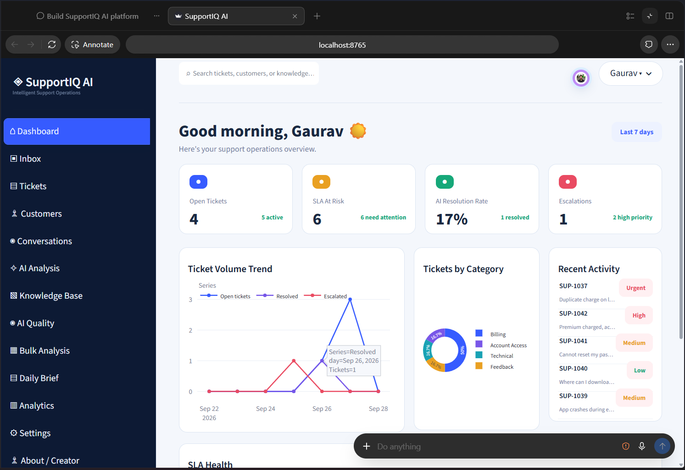
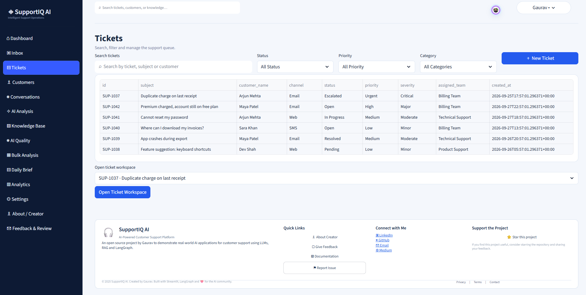
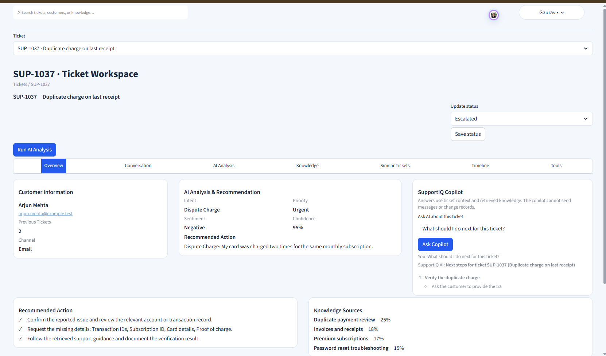
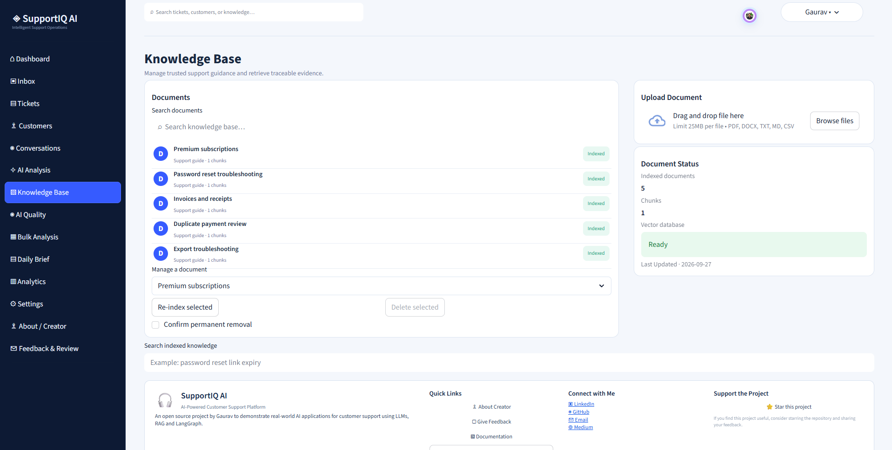
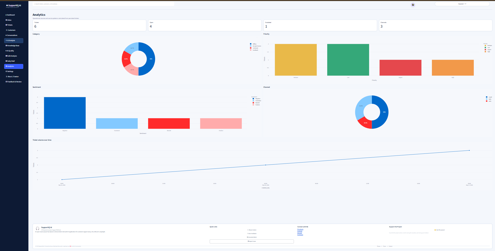
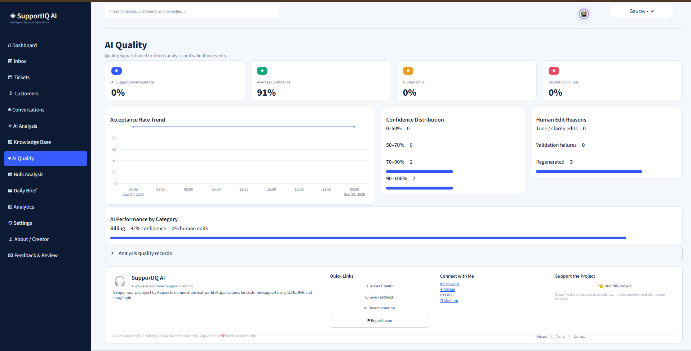
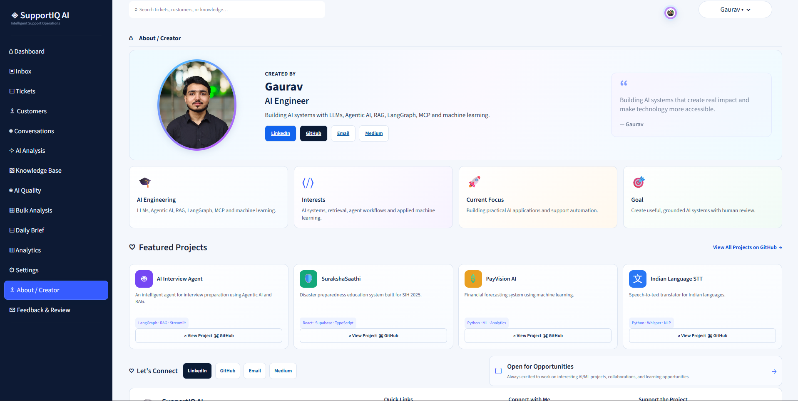
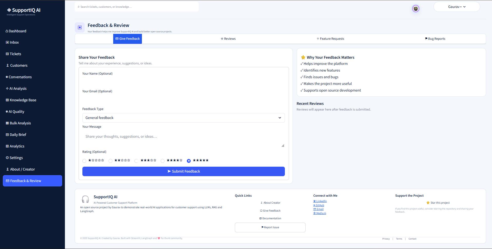

<div align="center">

# 🚀 SupportIQ AI

### Intelligent Customer Support Analysis & Resolution Platform

**AI-powered support operations for analyzing, investigating, prioritizing, and resolving customer support tickets.**

<p>
  
  
  
  
  
  
</p>

</div>

---

## 📌 Overview

**SupportIQ AI** is an AI-assisted customer support operations platform built with Python and Streamlit.

Instead of acting as a simple chatbot or ticket classifier, the platform brings multiple support workflows together in one workspace. It can analyze incoming tickets, understand customer context, retrieve relevant knowledge, identify similar cases, evaluate SLA risk, recommend actions, assist support agents, validate generated responses, and maintain an operational timeline.

The platform is designed around an important principle:

> **AI assists the support team; humans remain in control of customer-facing actions.**

Customer-facing email and SMS messages require explicit human approval before being sent.

---

## 🧠 How SupportIQ AI Works

```text
Customer Ticket / Conversation
              │
              ▼
       Customer Context
              │
              ▼
        AI Ticket Analysis
              │
      ┌───────┴────────┐
      ▼                ▼
 Knowledge RAG    Similar Cases
      │                │
      └───────┬────────┘
              ▼
      Investigation & SLA
              │
              ▼
 Resolution / Routing / Escalation
              │
              ▼
       Response Generation
              │
              ▼
       Response Validation
              │
              ▼
        Human Approval
              │
       ┌──────┴──────┐
       ▼             ▼
     Email          SMS
       │             │
       └──────┬──────┘
              ▼
       Ticket Timeline
              │
              ▼
        Analytics & AI Quality
```

---

## ✨ Key Features

### 🎫 Intelligent Ticket Analysis

SupportIQ AI analyzes tickets using the configured Groq model and produces structured support intelligence including:

- Intent
- Category
- Priority
- Severity
- Sentiment
- AI confidence
- Customer impact
- Missing information
- Recommended next action
- Escalation recommendation

### 👤 Customer 360

The Customer 360 workspace brings customer information and support history together so agents can understand the situation before taking action.

It can surface:

- Customer profile
- Previous tickets
- Open and resolved cases
- Conversations
- Support activity
- Relevant customer context

### 📚 RAG Knowledge Base

The platform uses Retrieval-Augmented Generation to ground AI assistance in support knowledge.

The RAG pipeline uses:

- Sentence Transformers
- ChromaDB
- Document metadata
- Semantic similarity retrieval
- Retrieved evidence for AI workflows

This helps the system use relevant support information rather than relying only on the model's general knowledge.

### 🔗 LangGraph AI Workflow

LangGraph is used to organize the AI processing flow into structured stages rather than one large model call.

The workflow can coordinate:

- Ticket analysis
- Customer context
- Knowledge retrieval
- Similar-ticket detection
- Investigation
- Resolution recommendation
- Escalation evaluation
- Response generation
- Response validation

### 🛠️ Controlled MCP Tools

SupportIQ AI includes controlled tool interactions for support operations.

Tools are structured around defined inputs and outputs instead of allowing unrestricted actions.

The current implementation includes controlled support-data access and keeps customer-facing actions behind the approval workflow.

### 🔎 Similar & Duplicate Cases

The system searches for related historical tickets and highlights probable duplicates.

This helps agents:

- Find previous solutions
- Compare similar incidents
- Avoid repeating investigation work
- Identify possible duplicate requests

### ⏱️ SLA & Escalation Intelligence

Tickets can be evaluated against SLA information and operational conditions.

The platform can surface:

- SLA risk
- Breached tickets
- Escalation signals
- Priority/impact context
- Recommended escalation

### 🤖 SupportIQ Copilot

The Ticket Workspace includes an AI Copilot that can answer questions about the selected ticket using available ticket context and retrieved knowledge.

Example questions include:

- What should I do next?
- Why is this ticket high priority?
- What information is missing?
- What similar cases exist?
- What knowledge should I review?

### ✉️ Email & SMS

SupportIQ AI provides communication adapters for:

- Email
- SMS

The application supports demo/local adapters as well as optional provider configuration.

All customer-facing communication remains approval-gated.

### 🛡️ Response Validation & Human Approval

Generated responses are not treated as automatically approved customer communications.

The workflow provides a validation and review stage before a message can be sent.

This helps reduce the risk of:

- Unsupported claims
- Incorrect information
- Unapproved actions
- Accidental customer communication

### 📊 Analytics & AI Quality

The application provides operational analytics and AI quality information covering support activity and AI-assisted workflows.

### 📥 Bulk Ticket Analysis

Support teams can upload ticket data in CSV format and run structured analysis across multiple records, with downloadable results.

### 📝 Daily Support Brief

The Daily Brief provides a concise operational view of important support activity such as ticket volume, SLA risk, escalations, and other available support signals.

### 🕒 Ticket Timeline

Important events are recorded in a chronological ticket timeline, including AI analysis, tool calls, similar-case detection, escalation recommendations, and ticket activity.

### 💬 Feedback & Review

The platform includes a feedback workflow supporting:

- Ratings
- General feedback
- Bug reports
- Feature requests
- UI/UX feedback
- AI quality feedback
- RAG/knowledge feedback

---

## 🖥️ Application Screens

### 📊 Dashboard

The dashboard provides an operational overview of support activity, ticket status, SLA signals, AI-related metrics, and recent activity.



### 🎫 Tickets

The Tickets workspace provides search, filtering, ticket status management, priority/category views, and access to the Ticket Workspace.



### 🔍 Ticket Workspace

The Ticket Workspace is the central investigation area combining customer context, AI analysis, Copilot, knowledge, similar tickets, timeline information, and controlled tools.



### 📚 Knowledge Base

The Knowledge Base supports document-based retrieval for grounding AI analysis and recommendations.



### 📈 Analytics

Analytics provides a visual view of ticket activity and support performance.



### 🧪 AI Quality

The AI Quality area provides visibility into AI-assisted support quality and workflow outcomes.



### 👨‍💻 About / Creator

The application includes a dedicated creator section for project information and creator details.



### 💬 Feedback & Review

Users can submit feedback, ratings, bug reports, feature requests, and other suggestions directly from the application.



---

## 🧩 Technology Stack

| Layer | Technology |
|---|---|
| Frontend / UI | Streamlit |
| Programming Language | Python 3.10+ |
| LLM | Groq — `openai/gpt-oss-20b` |
| AI Orchestration | LangGraph |
| RAG | ChromaDB + Sentence Transformers |
| Database | SQLite |
| Data Processing | Pandas |
| Visualization | Plotly |
| Tool Layer | Controlled MCP-style tools |
| Email | SMTP / Demo Adapter |
| SMS | Twilio / Demo Adapter |
| Configuration | python-dotenv |

---

## 🗂️ Project Structure

```text
SupportIQ_AI/
│
├── app.py
├── requirements.txt
├── README.md
├── .env.example
│
├── supportiq/
│   ├── ai.py
│   ├── communications.py
│   ├── config.py
│   ├── db.py
│   ├── mcp_tools.py
│   ├── rag.py
│   ├── services.py
│   └── ui.py
│
├── tests/
│
└── data/
    ├── supportiq.sqlite3
    └── chroma/
```

---

## ⚡ Quick Start

### 1. Clone the repository

```powershell
git clone https://github.com/YOUR_USERNAME/SupportIQ_AI.git
cd SupportIQ_AI
```

### 2. Create a virtual environment

```powershell
py -3.10 -m venv .venv
.\.venv\Scripts\Activate.ps1
```

### 3. Install dependencies

```powershell
python -m pip install --upgrade pip
pip install -r requirements.txt
```

### 4. Create the environment file

```powershell
Copy-Item .env.example .env
```

For live Groq AI analysis, configure:

```env
GROQ_API_KEY=YOUR_GROQ_API_KEY
LLM_MODEL=openai/gpt-oss-20b
```

### 5. Start the application

```powershell
streamlit run app.py
```

Optional custom port:

```powershell
streamlit run app.py --server.port 8765
```

Open the local Streamlit URL shown in the terminal.

---

## ⚙️ Configuration

Important configuration values include:

```env
GROQ_API_KEY=
LLM_MODEL=openai/gpt-oss-20b

SUPPORTIQ_MODE=demo
SUPPORTIQ_DB_PATH=data/supportiq.sqlite3
SUPPORTIQ_VECTOR_PATH=data/chroma
SUPPORTIQ_EMBEDDING_MODEL=all-MiniLM-L6-v2

SUPPORTIQ_GITHUB_REPO=https://github.com/RGTrigger/SupportIQ-AI

EMAIL_PROVIDER=demo
SMS_PROVIDER=demo
```

Optional SMTP and Twilio configuration can be added when live communication providers are required.

### 🔐 Security

Never commit:

```text
.env
.streamlit/secrets.toml
API keys
database files containing sensitive data
private provider credentials
```

Use Streamlit secrets or environment variables for deployment credentials.

---

## 🧪 Testing

Run the project's automated tests with:

```powershell
python -m unittest discover -s tests -v
```

The test coverage includes application behavior such as:

- Navigation and page rendering
- Ticket workflows
- AI analysis
- RAG behavior
- Controlled tools
- Approval workflows
- Communication adapters
- Bulk analysis
- Input validation
- UI-related behavior

---

## ☁️ Deployment

SupportIQ AI can be deployed using **Streamlit Community Cloud**.

### Deployment steps

1. Push the project to GitHub.
2. Create a new application in Streamlit Community Cloud.
3. Select the GitHub repository and branch.
4. Set `app.py` as the application entrypoint.
5. Configure the required secrets.
6. Deploy the application.
7. Verify AI, database, RAG, navigation, and communication configuration.

Example Streamlit secrets:

```toml
GROQ_API_KEY = "YOUR_GROQ_API_KEY"
LLM_MODEL = "openai/gpt-oss-20b"
SUPPORTIQ_MODE = "demo"
SUPPORTIQ_GITHUB_REPO = "https://github.com/RGTrigger/SupportIQ-AI"
```

SMTP/Twilio settings should only be added when live provider integrations are intentionally configured.

> ⚠️ SQLite and ChromaDB currently use local application storage. Streamlit Community Cloud storage should be treated as ephemeral. A production multi-user deployment should use durable external database and vector storage.

---

## 🛡️ AI Safety & Reliability

SupportIQ AI follows a human-supervised approach to AI-assisted support.

Key safeguards include:

- 🔑 API credentials are kept outside application source code.
- 👤 Customer-facing messages require explicit human approval.
- 🛠️ Tool access is controlled through structured interfaces.
- 📄 Customer and document content is treated as untrusted input.
- ✅ Generated responses go through validation before approval.
- 📬 Demo email/SMS mode records messages locally without contacting real customers.
- 🚨 Provider failures are surfaced instead of being presented as successful delivery.
- 🧾 Important AI and workflow events can be recorded in the ticket timeline.

---

## 📋 Project Status

| Capability | Status |
|---|:---:|
| Streamlit application | ✅ |
| Dashboard | ✅ |
| Inbox / ticket workflows | ✅ |
| Customer 360 | ✅ |
| AI ticket analysis | ✅ |
| Groq integration | ✅ |
| LangGraph workflow | ✅ |
| RAG / ChromaDB | ✅ |
| Controlled MCP tools | ✅ |
| SLA management | ✅ |
| Escalation intelligence | ✅ |
| Similar / duplicate cases | ✅ |
| AI Support Copilot | ✅ |
| Response validation | ✅ |
| Human approval | ✅ |
| Email / SMS adapters | ✅ |
| AI Quality Dashboard | ✅ |
| Bulk ticket analysis | ✅ |
| Daily Support Brief | ✅ |
| Ticket timeline | ✅ |
| Analytics | ✅ |
| Feedback & Review | ✅ |

---

## 👨‍💻 Creator

### Gaurav — AI Engineer

Building AI systems with **LLMs, Agentic AI, RAG, LangGraph, MCP and machine learning**.

**Connect:**

- 🔗 LinkedIn: https://www.linkedin.com/in/rgtrigger/
- 💻 GitHub: https://github.com/RGTrigger
- ✉️ Email: rgtrigger.ai.dev@gmail.com
- 📝 Medium: https://medium.com/@rgtrigger.ai.dev/designing-an-agentic-ai-interview-preparation-agent-an-engineering-case-study-00a15d5a5a1f

---

<div align="center">

## ⭐ SupportIQ AI

**Intelligent Customer Support Analysis & Resolution Platform**

Built with ❤️ using Python, Streamlit, Groq, LangGraph, RAG, ChromaDB and controlled AI tooling.

</div>
